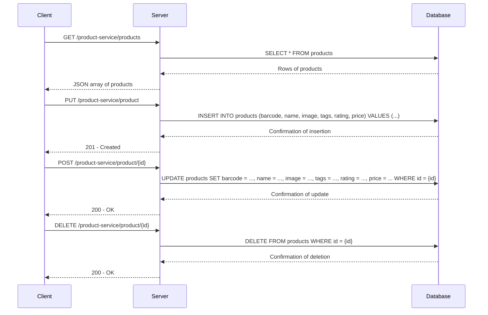

# Product Management System

This project is a full-stack application that manages products, providing functionalities to create, read, update, and delete products. It includes a backend service built with Node.js and Express, and a frontend client built with Angular. The backend uses MySQL as the database to store product information.

## Table of Contents

- [Installation](#installation)
- [Configuration](#configuration)
- [Running the Application](#running-the-application)
- [API Endpoints](#api-endpoints)
- [Database Schema](#database-schema)
- [Sequence Diagram](#sequence-diagram)
- [Frontend Development](#frontend-development)
- [License](#license)

## Installation

1. Clone the repository:
    ```sh
    git clone https://github.com/gal-Kolberg/Product-list.git
    cd Gal-Kolberg-Products-service
    ```

### Backend

2. Navigate to the backend directory:
    ```sh
    cd backend
    ```

3. Install backend dependencies:
    ```sh
    npm install
    ```

### Frontend

4. Navigate to the frontend directory:
    ```sh
    cd ../frontend
    ```

5. Install frontend dependencies:
    ```sh
    npm install
    ```

## Configuration

### Backend

Update the `backend/config.js` file to match your database settings. Example:
```javascript
module.exports = {
  database: {
    host: 'localhost',
    user: 'your-username',
    password: 'your-password',
    database: 'your-database'
  },
  server: {
    port: 3000
  }
};
```

### Frontend

Update the `frontend/src/app/shared/config/config.ts` file if necessary to match your backend server settings. Example:
```typescript
export const config = {
  urlPrefix: 'http://localhost',
  port: '3000',
  serverPrefix: '/product-service'
};
```

## Running the Application

### Backend

1. Start the backend service:
    ```sh
    cd backend
    npm start
    ```

### Frontend

2. Start the frontend development server:
    ```sh
    cd ../frontend
    ng serve
    ```

3. Navigate to `http://localhost:4200/` in your browser.

## API Endpoints

### `GET /product-service/products`

- **Request:** None
- **Response:**
    ```json5
    [
        {
            "id": 1,
            "barcode": 123456,
            "name": "product-name",
            "image": "http://url-to-image",
            "tags": ["tag1", "tag2"],
            "rating": 7.4,
            "price": 9.99
        },
        ...
    ]
    ```

### `PUT /product-service/product`

- **Request:**
    ```json5
    {
        "barcode": 123456,
        "name": "product-name",
        "image": "http://url-to-image",
        "tags": ["tag1", "tag2"],
        "rating": 7.4,
        "price": 9.99
    }
    ```
- **Response:** `201 - Created`

### `POST /product-service/product/{id}`

- **Request:**
    ```json5
    {
        "barcode": 123456,
        "name": "product-name",
        "image": "http://url-to-image",
        "tags": ["tag1", "tag2"],
        "rating": 7.4,
        "price": 9.99
    }
    ```
- **Response:** `200 - OK`

### `DELETE /product-service/product/{id}`

- **Request:** None
- **Response:** `200 - OK`

## Database Schema

The `products` table schema:
```sql
CREATE TABLE products (
    id INT AUTO_INCREMENT PRIMARY KEY,
    barcode BIGINT NOT NULL,
    name VARCHAR(255) NOT NULL,
    image VARCHAR(255),
    tags VARCHAR(255),
    rating DECIMAL(3, 1),
    price DECIMAL(10, 2)
);
```

## Sequence Diagram



## Frontend Development

### Development Server

Run `ng serve` for a dev server. Navigate to `http://localhost:4200/`. The application will automatically reload if you change any of the source files.

### Code Scaffolding

Run `ng generate component component-name` to generate a new component. You can also use `ng generate directive|pipe|service|class|guard|interface|enum|module`.

### Build

Run `ng build` to build the project. The build artifacts will be stored in the `dist/` directory.

### Running Unit Tests

Run `ng test` to execute the unit tests via [Karma](https://karma-runner.github.io).

### Running End-to-End Tests

Run `ng e2e` to execute the end-to-end tests via a platform of your choice. To use this command, you need to first add a package that implements end-to-end testing capabilities.

### Further Help

To get more help on the Angular CLI use `ng help` or go check out the [Angular CLI Overview and Command Reference](https://angular.dev/tools/cli) page.

## License

This project is licensed under the MIT License. See the [LICENSE](LICENSE) file for details.
