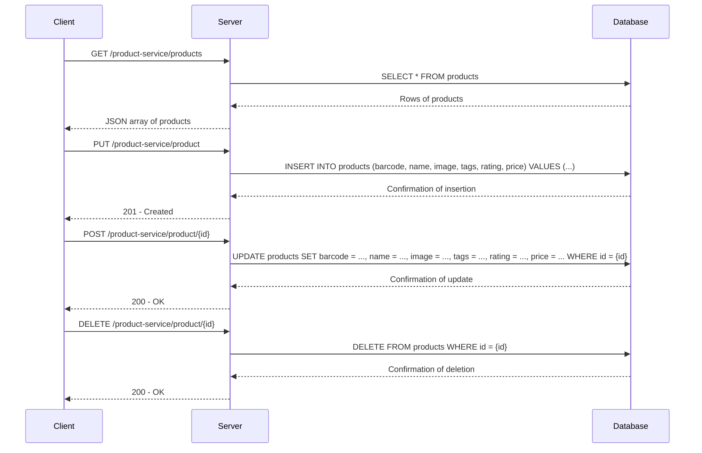

# Product Service API

This backend service manages products using a MySQL database. The API allows you to create, read, update, and delete products.

## Table of Contents
- [Installation](#installation)
- [Configuration](#configuration)
- [API Endpoints](#api-endpoints)
- [Database Schema](#database-schema)
- [Sequence Diagram](#sequence-diagram)
- [Running the Service](#running-the-service)

## Installation

1. Clone the repository:
    ```sh
    git clone https://github.com/NanoxAIDevelopment/Gal-Kolberg-Products-service.git
    cd Gal-Kolberg-Products-service
    ```

2. Install dependencies:
    ```sh
    npm install
    ```

## Configuration

Update the `config.js` file if necessary to match your database settings.

## API Endpoints

### `GET /product-service/products`
- **Request:** None
- **Response:**
    ```json5
    [
        {
            "id": 1,
            "barcode": 123456,
            "name": "product-name",
            "image": "http://url-to-image",
            "tags": ["tag1", "tag2"],
            "rating": 7.4,
            "price": 9.99
        },
        ...
    ]
    ```

### `PUT /product-service/product`
- **Request:**
    ```json5
    {
        "barcode": 123456,
        "name": "product-name",
        "image": "http://url-to-image",
        "tags": ["tag1", "tag2"],
        "rating": 7.4,
        "price": 9.99
    }
    ```
- **Response:** `201 - Created`

### `POST /product-service/product/{id}`
- **Request:**
    ```json5
    {
        "barcode": 123456,
        "name": "product-name",
        "image": "http://url-to-image",
        "tags": ["tag1", "tag2"],
        "rating": 7.4,
        "price": 9.99
    }
    ```
- **Response:** `200 - OK`

### `DELETE /product-service/product/{id}`
- **Request:** None
- **Response:** `200 - OK`

## Database Schema

The `products` table schema:
```sql
CREATE TABLE products (
    id INT AUTO_INCREMENT PRIMARY KEY,
    barcode BIGINT NOT NULL,
    name VARCHAR(255) NOT NULL,
    image VARCHAR(255),
    tags VARCHAR(255),
    rating DECIMAL(3, 1),
    price DECIMAL(10, 2)
);
```


